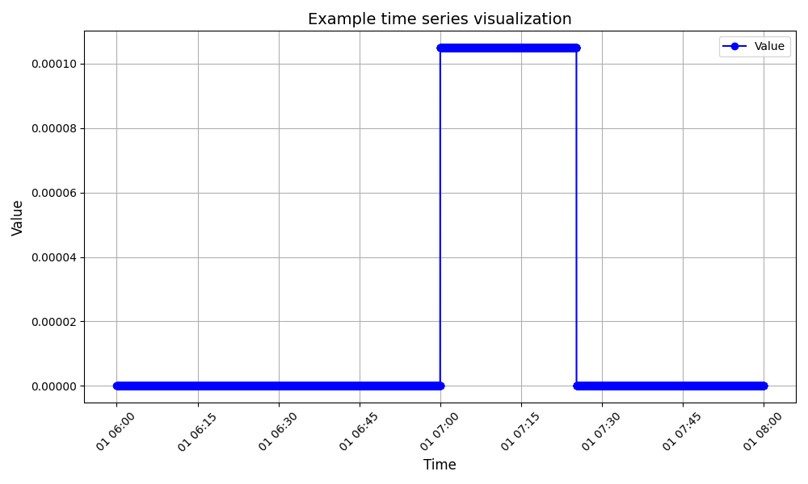

# OGC Process API for MARS Simulations

This ASP.NET Core application provides an OGC-compliant API to execute MARS simulations synchronously and asynchronously, and to retrieve the results. The application uses **Redis** to store jobs, processes, and results. Configuration data (e.g., Redis connection details) is defined in the `appsettings.json` file.

## Features

- **Synchronous and asynchronous** execution of MARS simulations.  
- Storage of jobs and results in **Redis**.  
- Provision of **Swagger documentation** at the local endpoint: `http://localhost:7002/swagger`.

## Prerequisites

- Installed **Docker** and **Docker Compose**.  
- A **Redis** container or running instance.  
- **.NET 9** SDK (for local development).

## Running the Application

The application can be started either via a Docker container or directly locally.

### Docker Compose

By using the `docker-compose.yml` file, all required services are created and the service is build, if necessary:

```bash
docker compose up
```

To rebuild the service using the `docker-compose.yml` file, use the following command:

```bash
docker compose build
```

### Start without Docker

To start the service not in the Docker but in the host, the services are still required:

```bash
dotnet run --environment Development --project SOH.Process.Server/SOH.Process.Server.csproj
```

After starting the redis database, you can run the service directly:

```bash
dotnet run --environment Development --project SOH.Proces.
```

### Access the API

The OpenAPI documentation can be explored using Swagger UI: (http://localhost:8080/swagger/index.html)

>> Ensure you access the UI with `http` not `https`, otherwise the server needs a trusted certificate, which is often only provided by the reverse proxy.

You can use `curl` to access the REST resources. For example when search for existing simulations run:

```bash
curl -X 'GET' 'http://localhost:8080/processes?limit=10&searchQuery=ferry'
```
You get a list of existing and available processes to run, matching the query `ferry`.

### Running an existing simulation

The OGC process API provides two execution modes and the service already provide one simulation by default. The ferry transfer model of SmartOpenHamburg. To execute the simulation directly and returning all agents and ther intermediate states of each tick, send a REST request as follows, e.g., with `curl`: 
```bash
curl -X 'POST' \
'http://localhost:8080/processes/sim-ferryTransfer-default/execution' \
-H 'accept: application/json' \
-H 'Content-Type: application/json' \
-d '{
    "outputs": {
        "agents": {}
    }
}'
```

returns the concrete result - here as GeoJson as FeatureCollection with all agents, their attribute, position by time.

You can combine or select other outputs for a single job e.g., to get a time series of average road occupation and saving the response in `result.json`. For example, you can select teh `green4bikes` model and configure the average road occupation using:

```bash
curl -X 'POST' \
'http://localhost:8080/processes/sim-green4Bikes-default/execution' \
-H 'accept: application/json' \
-H 'Content-Type: application/json' \
-d '{
    "outputs": {
        "soh_output_avg_road_count": {}
    }
}' > results.json
```
returning the concrete time series of average occupation across each edge.

#### Example visualization
 
Prepare your `venv` environment and activate the interpreter. 

```bash
python3 -m venv .venv
source .venv/bin/activate
```

Install the visualization library e.g., `matplotlib`.

```bash
pip install matplotlib
```

Use the `visualize_time_series.py` script to show the increase and decrease of road usages over time:

```bash
pip install matplotlib
python3 visualize_time_series.py result.json
```

>> The default green4bikes scenario configuration only contains a single agent

The result should look like, showing the average road occupation:



Process also can be executed asynchronously in which the server responds with a `201` and job description, which can be used to retrieve the status or result if already exist. Use the following command:

```bash
curl -X 'POST' \
'http://localhost:8080/processes/sim-ferryTransfer-default/execution' \
-H 'accept: application/json' \
-H 'Content-Type: application/json' \
-H 'Prefer: respond-async' \
-d '{
    "outputs": {
        "agents": {}
    }
}' > results.json
```
returns a job with unique ``jobID`` associated to the selected simulation process and the actual execution status.

### Docker Build

Create the single Docker image for the service, use the following command:

```bash
docker build -t mars-ogc-api -f ./SOH.Process.Server/Dockerfile .
```

### Starting the Docker Container

Start the application with:

```bash
docker run -p 7002:7002 --env-file .env mars-ogc-api
```

> Note: Adjust the environment variables in the `.env` file or the `docker run` command as needed.

### Accessing Swagger

After starting the application, you can access the API documentation at the Swagger endpoint:

```
https://localhost:7002/swagger
```

## Configuration

Redis connection details and other environment variables are managed in the `appsettings.json` file. Example:

```json
{
  "Redis": {
    "ConnectionString": "localhost:6379"
  },
  "Logging": {
    "LogLevel": {
      "Default": "Information"
    }
  }
}
```

## Endpoints

The API provides the following main endpoints according to the specification ([OGC API Processes Specification](https://docs.ogc.org/is/18-062r2/18-062r2.html#toc0)):

- **/**: Retrieve the landing page.
- **/processes**: Manage and list available processes. Execute processes.
- **/jobs**: Create, query status, and retrieve results of asynchronous jobs.
- **/conformances**: Retrieve the server's conformance declarations.

## Development

Run the application locally using the .NET CLI:

```bash
dotnet run --urls=http://localhost:7002
```

For testing, the system uses `testcontainers` and ad-hoc start an own redis or other required services in background.

```bash
dotnet test
```